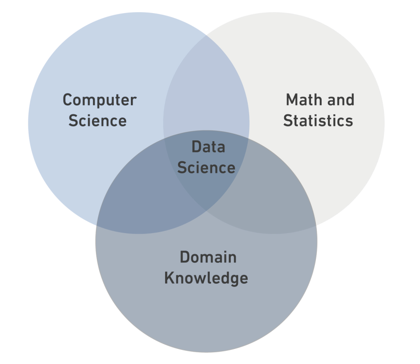

# Data Science
## What is Data Science?
**Data Science** is a *“multidisciplinary field* that combines, computer science, and domain knowledge.


### Data Types:
- Structured
- Semi-Structured 
- Unstructured


| Structured | Semi-Structured | Unstructured |
| ---------- | --------------- | ------------ |
| It is data that has been organized into a strict schema. | It is data does not conform to schema but has some structure. | It is data that has no schema |
| e.g: tables   | e.g: xml  | e.g: photo |
 ```python
print("DS Bootcamp")
```
